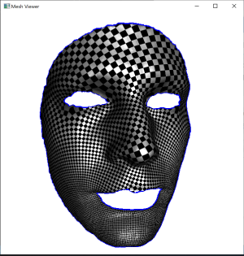
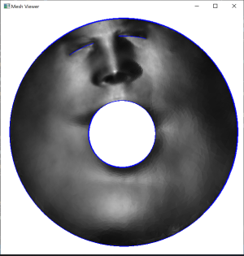

# Koebe Iteration

This C++ project framework is used to help students to implement Koebe iteration algorithm. It contains a simple opengl viewer.

## Dependencies
 
1. `MeshLib`, a mesh library based on halfedge data structure.
2. `Delaunay`, a delaunay triangulation library.
3. `Hodge`, a Hodge decomposition library.
4. `freeglut`, a free-software/open-source alternative to the OpenGL Utility Toolkit (GLUT) library.
5. `Eigen`, a C++ template library for linear algebra.

## Directory Structure

``` txt
include          -- The header files of Koebe iteration algorithm.
src              -- The source files of Koebe iteration algorithm. 
CMakeLists.txt   -- CMake configuration file.
```

## Configuration

### Windows

1. Install [CMake](https://cmake.org/download/).

2. Download the source code of the C++ framework.
> E.x. I create a folder `projects` in `C:/`, then unzip the source code there.

3. Configure and generate the project for Visual Studio.

> ``` bash
> cd CCGHomework
> mkdir build
> cd build
> cmake ..
> ```
> *One can also finish this step using CMake GUI.*

4. Open the \*.sln using Visual Studio, and complie the solution to check that everything is all right.

5. Finish your code in your IDE.

6. Compile the project `INSTALL` while you finish your code.
> *One need to copy the freeglut.dll, Delaunay(d).dll and Hodge(d).dll (depend on your solution platform) into the folder `bin`,
> if your program cannot find them.*

7. Run the executable program.
> E.x. 
> ``` bash
> cd ../data/boy_3_holes/
> ./koebe_iteration_test.bat
> ```

8. Press '?' when your mouse is focused on the glut window, and follow the instruction in the command line window.
> If you can see the following results, then it means that you have finished the harmonic map algorithm. 
> 
>  

### Linux

1. Build and compile the code.

> ``` bash
> cd CCGHomework
> mkdir build
> cd build
> cmake ..
> make && make install
> sudo cp ../3rdparty/Delaunay/lib/linux/libDelaunay*.so /usr/lib/
> sudo cp ../3rdparty/Hodge/lib/linux/libHodge*.so /usr/lib/
> ```

2. Run the executable program.

> ``` bash
> cd ../data/boy_3_holes/
> chmod +x *.sh            # if needed
> ./koebe_iteration_test.sh
> ```

### Mac

The libraries do not support Mac OS now.
